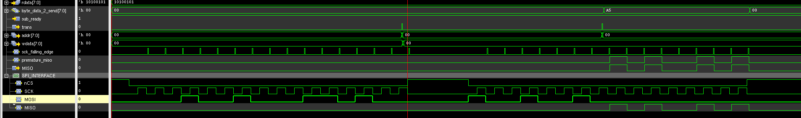
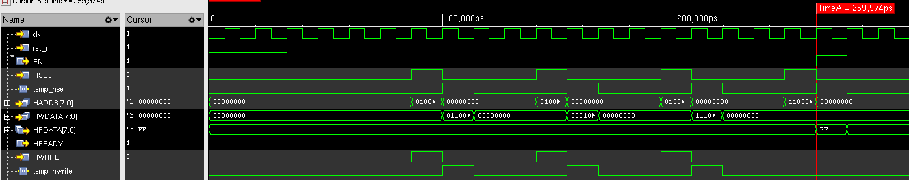

# Project Dune

This is the project run to design and implement the upcoming chip 4 implementation starting from Jan 2026.

May the power of Dune be with us to make the sand into a magic chip.

## 06 Jan 2026

After last years meeting, Piotr proposed the update to the 5 pixel Row based encoder to reduce state transitions for our finite state machine.

And now I am working on it to make construct this new state machine. That is, the encoder will not report the special timing words when it is actively pushing data out. Instead, it will output timing words when it is in the WAIT state, but it will also output the middle part of the time stamp.

That is:

```text
//// global ocunter tik_tok[44:0] ==> H: tik_tok[44:30]; M: tik_tok[29:15]; L: tik_tok[14:0]

16'h8000 ## Special timing word
16'h0002 ## the middle par of the global counter tik_tok
```

And in the meantime, I will design the compression module to include the pixel mask. This would allow the user to block out one single pixel from producing active pixel values. 

1-bit mode will not be included just yet.

I have just updated the module to only report the alarm at WAIT state, and in the meantime, it will append the middle bit of the global counter tik_tok.

I have also trimmed some unnecessary register for this state machine.

But the corner case here is probably when in the WAIT state, both the *pixel data change* and *alarm trigger* happened the same time.

In this case, we will lose one set of pixel value.

As for the triple time stamp case, I prefer to not include it. The inclusion of it will likely break the 2 clock cycle our FSM is having.

Additionally, we probably will not have enough space for all the ports if we include them all.


What is happening next will be addition of the pixel mask, which should be a very easy edit.

And this has been modified now with the new encoder.


## 07 Jan 2026

I am thinking of implementing the SPI register control banks today.

I have got the interface ready, but it will be very trivial and redundant to have a 200 8-bit register bank as output for one module just to mask off one individual pixel.

The routing for this will be a nightmare.

Instead, we will include a simple bus system, where the input configurations for the system will be broadcast to the bus, and each individual shall pick up correspondingly. So we will have a simple AHB-like bus system for this.

So far I am planning to design 8 groups for our next chip, each group will have 8 channels of 5 pixels.

So the bus system will have an 8-bit address and 8-bit data, which should be enough for our use.


**Address byte format**

```text
addr[7]   = R/W        (0=write, 1=read)
addr[6]   = SPACE      (0=Global, 1=Channel)
addr[5:3] = ID         (Global: block_id 0..7,  Channel: ch_id 0..7)
addr[2:0] = OFFSET     (0..7 within that block/channel)

```


The system will look something like this:

```text

SPI -> {addr[7:0], wdata[7:0]}
               |
               v
        +---------------+
        |  Decoder      |
        | if addr[6]=0: |--> global_sel[block_id]
        | if addr[6]=1: |--> ch_sel[ch_id]
        +---------------+
          | broadcast addr[2:0], wdata, wr/rd
          |
   +------+-----------------------------+
   |                                    |
   v                                    v
Global block (PLL/LVDS/...)      Channel i (x8 identical)
uses reg_off=addr[3:0]           uses reg_off=addr[3:0]
                                 if reg_off==0: mask write
```


## 08 Jan 2026

I have one SPI slave module implemented, which treated the SPI clock as one driving clock. This would later on introduce inevitable clock domain crossing issue.

Especially in our case, the transmitted signal will be broadcast over the bus to each individual component.


Therefore, we shall have the following specs:


+ Set clk_cfg = 75 MHz (same as arbiter/packet builder).
+ Keep LVDS/serializer at 75 + 150 + 300 MHz, but treat 150/300 as local high-speed clocks only inside the serializer – your config bank doesn’t need to see them.
+ Run spi_slave_oversamp + AMBA-like bus + reg bank all on clk_cfg = 75 MHz.
+ Limit SCLK to around 5–8 MHz so oversampling and edge detection are robust.
+ Treat config bits going into 20/40 MHz domains as static; write them before starting the pixel/compression clocks.

This would mean that we will not run the SPI configuration at the beginning of the chip bring-up. The chip status will be written in one register and returned to FPGA.

FPGA will have to check regularly during bring up on the SPI interface to make sure the chip is ready and brought up.


## 09 Jan 2026

Simply drafted the skeleton of the SPI control bank with the designed bus.


## 12 Jan 2026

I will now debug it for the correct data transmission, especially for the AMBA-like bus.

I have finished the design for SPI interface, the module is also tested against the test bench.



The write sequence tested is 

```text
0x12   ## address is 8'h12, 0001_0010
0x34   ## transmitted data should be 8'h34, 0011_0100
```


While the read sequence tested should be:

```text
0x92  ## address is 8'h92, 1001_0010
0x00  ## dummy byte
0xA5  ## supposedly the read byte 8'hA5, 1010_0101
```

It has to be noted that the write cycle should be like this:

```text
MOSI: [ADDR byte] [DUMMY]
MISO:            [DATA byte]
```

Where the retrieve data byte should be output while the dummy byte is still being output.


I shall plot bus design for later integration of submodules.


I have now also added the decoder into the module and hopefully it will integrate well with the bus.


## 13 Jan 2026

After reviewing the SPI slave/AMBA-manager design with Piotr, I raised my concern about the scaling problem.

He suggested the distributed address decoder instead of a centralised address decoder with 16 select lines.

But I guess the bottle neck is with the big read data mux instead of the decoder.

Assume we have 32 channels that returns 8-bit data, the input to the mux would be 32x8 = 256 pins RDATA, and also 32 pins READY signal and 5-bit mux index, with only 8-bit data output and 1-bit ready signal.

But for our decoder, the input will be 8-bit address (suppose our address widths stay the same), the output will be 32 pins. For a system this big, it feels okay.


**Possible solution**

Solution A:

What was proposed was to add all the output to a global shared bus, with tri-state buffer design.

And this shared buffer will be fed back to the manager.

For me, ideally, I would prefer to not include tri-state buffer into the design.


Solution B:

Another possible solution is we keep the idea of shared bus.

But we do the big OR-gating to the shared RDATA bus.


```verilog
// Shared READ DATA bus
wire [7:0] HRDATA;
// Enable the output of the subordinates
wire [7:0] Enable;
// Raw output of each sub
wire [7:0] RDATA_RAW [7:0];
// Final Output of each subordinates
wire [7:0] RDATA_sub_0, RDATA_sub_1, RDATA_sub_2, RDATA_sub_3, RDATA_sub_4, RDATA_sub_5, RDATA_sub_6, RDATA_sub_7;


assign RDATA_sub_0 = Enable[0]? RDATA_RAW[0] : 8'd0;
assign RDATA_sub_1 = Enable[1]? RDATA_RAW[1] : 8'd0;
assign RDATA_sub_2 = Enable[2]? RDATA_RAW[2] : 8'd0;
assign RDATA_sub_3 = Enable[3]? RDATA_RAW[3] : 8'd0;
assign RDATA_sub_4 = Enable[4]? RDATA_RAW[4] : 8'd0;
...

HRDATA = RDATA_sub_0 | RDATA_sub_1 | RDATA_sub_2 | ..... RDATA_sub_7;

```

So we simply just add 1 more signal at the subordinate module.


## 14 Jan 2026


Today I will try to finish one of the AHB bus slave register.


This has been finished with the behaviour illustrated in the waveform,  



Because our AHB interface will only select one sub at at time in the middle of SPI data shifting, we do not need to worry multiple subs being selected at the same time. 

There will also not be address/data pipeline, so we do not need to consider much about mutual exclusion.

Next stage would be the integration simulation to see if the channel reg control bank would work.

I have just verified the integration for the SPI+reg control bank+CFG decoder.

The test case includes both writing sequence and reading sequence for our pixel block bank 000, which should have the address of 0100_0000 when writing and 1100_0000 when reading.

Will work on the simple SPI module for Steve next.

