# Project Dune

This is the project run to design and implement the upcoming chip 4 implementation starting from Jan 2026.

May the power of Dune be with us to make the sand into a magic chip.

## 06 Jan 2026

After last years meeting, Piotr proposed the update to the 5 pixel Row based encoder to reduce state transitions for our finite state machine.

And now I am working on it to make construct this new state machine. That is, the encoder will not report the special timing words when it is actively pushing data out. Instead, it will output timing words when it is in the WAIT state, but it will also output the middle part of the time stamp.

That is:

```text
//// global ocunter tik_tok[44:0] ==> H: tik_tok[44:30]; M: tik_tok[29:15]; L: tik_tok[14:0]

16'h8000 ## Special timing word
16'h0002 ## the middle par of the global counter tik_tok
```

And in the meantime, I will design the compression module to include the pixel mask. This would allow the user to block out one single pixel from producing active pixel values. 

1-bit mode will not be included just yet.

I have just updated the module to only report the alarm at WAIT state, and in the meantime, it will append the middle bit of the global counter tik_tok.

I have also trimmed some unnecessary register for this state machine.

But the corner case here is probably when in the WAIT state, both the *pixel data change* and *alarm trigger* happened the same time.

In this case, we will lose one set of pixel value.

As for the triple time stamp case, I prefer to not include it. The inclusion of it will likely break the 2 clock cycle our FSM is having.

Additionally, we probably will not have enough space for all the ports if we include them all.


What is happening next will be addition of the pixel mask, which should be a very easy edit.

And this has been modified now with the new encoder.


## 07 Jan 2026

I am thinking of implementing the SPI register control banks today.

I have got the interface ready, but it will be very trivial and redundant to have a 200 8-bit register bank as output for one module just to mask off one individual pixel.

The routing for this will be a nightmare.

Instead, we will include a simple bus system, where the input configurations for the system will be broadcast to the bus, and each individual shall pick up correspondingly. So we will have a simple AHB-like bus system for this.

So far I am planning to design 8 groups for our next chip, each group will have 8 channels of 5 pixels.

So the bus system will have an 8-bit address and 8-bit data, which should be enough for our use.


**Address byte format**

```text
addr[7]   = R/W        (0=write, 1=read)
addr[6]   = SPACE      (0=Global, 1=Channel)
addr[5:3] = ID         (Global: block_id 0..7,  Channel: ch_id 0..7)
addr[2:0] = OFFSET     (0..7 within that block/channel)

```


The system will look something like this:

```text

SPI -> {addr[7:0], wdata[7:0]}
               |
               v
        +---------------+
        |  Decoder      |
        | if addr[6]=0: |--> global_sel[block_id]
        | if addr[6]=1: |--> ch_sel[ch_id]
        +---------------+
          | broadcast addr[2:0], wdata, wr/rd
          |
   +------+-----------------------------+
   |                                    |
   v                                    v
Global block (PLL/LVDS/...)      Channel i (x8 identical)
uses reg_off=addr[3:0]           uses reg_off=addr[3:0]
                                 if reg_off==0: mask write
```


## 08 Jan 2026

I have one SPI slave module implemented, which treated the SPI clock as one driving clock. This would later on introduce inevitable clock domain crossing issue.

Especially in our case, the transmitted signal will be broadcast over the bus to each individual component.


Therefore, we shall have the following specs:


+ Set clk_cfg = 75 MHz (same as arbiter/packet builder).
+ Keep LVDS/serializer at 75 + 150 + 300 MHz, but treat 150/300 as local high-speed clocks only inside the serializer – your config bank doesn’t need to see them.
+ Run spi_slave_oversamp + AMBA-like bus + reg bank all on clk_cfg = 75 MHz.
+ Limit SCLK to around 5–8 MHz so oversampling and edge detection are robust.
+ Treat config bits going into 20/40 MHz domains as static; write them before starting the pixel/compression clocks.

This would mean that we will not run the SPI configuration at the beginning of the chip bring-up. The chip status will be written in one register and returned to FPGA.

FPGA will have to check regularly during bring up on the SPI interface to make sure the chip is ready and brought up.


## 09 Jan 2026

Simply drafted the skeleton of the SPI control bank with the designed bus.


## 12 Jan 2026

I will now debug it for the correct data transmission, especially for the AMBA-like bus.

I have finished the design for SPI interface, the module is also tested against the test bench.

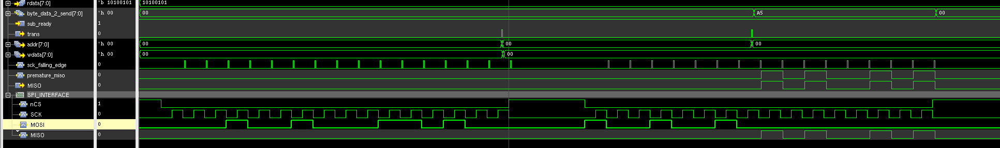

The write sequence tested is 

```text
0x12   ## address is 8'h12, 0001_0010
0x34   ## transmitted data should be 8'h34, 0011_0100
```


While the read sequence tested should be:

```text
0x92  ## address is 8'h92, 1001_0010
0x00  ## dummy byte
0xA5  ## supposedly the read byte 8'hA5, 1010_0101
```

It has to be noted that the write cycle should be like this:

```text
MOSI: [ADDR byte] [DUMMY]
MISO:            [DATA byte]
```

Where the retrieve data byte should be output while the dummy byte is still being output.


I shall plot bus design for later integration of submodules.


I have now also added the decoder into the module and hopefully it will integrate well with the bus.


## 13 Jan 2026

After reviewing the SPI slave/AMBA-manager design with Piotr, I raised my concern about the scaling problem.

He suggested the distributed address decoder instead of a centralised address decoder with 16 select lines.

But I guess the bottle neck is with the big read data mux instead of the decoder.

Assume we have 32 channels that returns 8-bit data, the input to the mux would be 32x8 = 256 pins RDATA, and also 32 pins READY signal and 5-bit mux index, with only 8-bit data output and 1-bit ready signal.

But for our decoder, the input will be 8-bit address (suppose our address widths stay the same), the output will be 32 pins. For a system this big, it feels okay.


**Possible solution**

Solution A:

What was proposed was to add all the output to a global shared bus, with tri-state buffer design.

And this shared buffer will be fed back to the manager.

For me, ideally, I would prefer to not include tri-state buffer into the design.


Solution B:

Another possible solution is we keep the idea of shared bus.

But we do the big OR-gating to the shared RDATA bus.


```verilog
// Shared READ DATA bus
wire [7:0] HRDATA;
// Enable the output of the subordinates
wire [7:0] Enable;
// Raw output of each sub
wire [7:0] RDATA_RAW [7:0];
// Final Output of each subordinates
wire [7:0] RDATA_sub_0, RDATA_sub_1, RDATA_sub_2, RDATA_sub_3, RDATA_sub_4, RDATA_sub_5, RDATA_sub_6, RDATA_sub_7;


assign RDATA_sub_0 = Enable[0]? RDATA_RAW[0] : 8'd0;
assign RDATA_sub_1 = Enable[1]? RDATA_RAW[1] : 8'd0;
assign RDATA_sub_2 = Enable[2]? RDATA_RAW[2] : 8'd0;
assign RDATA_sub_3 = Enable[3]? RDATA_RAW[3] : 8'd0;
assign RDATA_sub_4 = Enable[4]? RDATA_RAW[4] : 8'd0;
...

HRDATA = RDATA_sub_0 | RDATA_sub_1 | RDATA_sub_2 | ..... RDATA_sub_7;

```

So we simply just add 1 more signal at the subordinate module.


## 14 Jan 2026


Today I will try to finish one of the AHB bus slave register.


This has been finished with the behaviour illustrated in the waveform,  

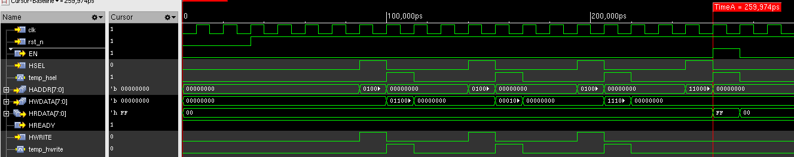

Because our AHB interface will only select one sub at at time in the middle of SPI data shifting, we do not need to worry multiple subs being selected at the same time. 

There will also not be address/data pipeline, so we do not need to consider much about mutual exclusion.

Next stage would be the integration simulation to see if the channel reg control bank would work.

I have just verified the integration for the SPI+reg control bank+CFG decoder.

The test case includes both writing sequence and reading sequence for our pixel block bank 000, which should have the address of 0100_0000 when writing and 1100_0000 when reading.

Will work on the simple SPI module for Steve next.


## 09 Feb 2026

Now I have the algorithm for our arbiter, it is also important to develop the packet style and have the RTL ready for the arbiter.

And I have the rough idea of packet design as below:

```
#### Start of the frame ####

[0xFA][0xCE] ==> "FACE"

#### Header ####

[0xXX] ==> type of the packet, key information or anything useful (number of channel sub-packets in this frame)

#### Channel ID + length of the packet ####

[0xXX] ==> 000_10111 --> channel 0, with 24 words

#### Pay load ####

[0xXX] [0xXX] ....... ==> double the length for the bytes

#### End of the frame ####

[0xDE] [0xAD] ==> "DEAD"

#### IDLE word ####

[0xBC]

#### Training words ####

Alternating [0xBC] [0x4D]

```

Combined with our arbiter algorithms, we have the following triggers to emit our built up frame:

1. Completed planned sweep (0→7 visited under current policy)
2. Jump forward (skip middle, end at 7) → end frame after the last served in that sweep
3. Jump backward (preempt to smaller index) → end frame at last served before wrap
4. Builder-near-full, but refined as: can’t fit the next whole chunk -> seal frame now
5. End-of-frame because “nothing was added in this sweep” -> don't emit a frame (stay IDLE)

But in this design, I did not include CRC-16 to this coding. I think it would be expensive for this module.


## 11 Feb 2026

I have tried to implement the congestion aware round-robin arbiter, but it appears to be more challenging than I thought.

This has been designed as external logic + function algorithm.

The module itself will simply do the pop function and provide which FIFO to pop, and it will simply be combinational.

The external register update will be processed by traditional hardware language.


I did the simulation that hooks up our FIFOs and the scheduler with the following test case:

```text

Under the condition of max read of 8, FIFO depth of 256

============== Phase 1: Seed all FIFOs =================

We push different levels of content to all FIFOS:

FIFO 0: 40;
FIFO 1: 30;
FIFO 2: 20;
FIFO 3: 10;
FIFO 4: 25;
FIFO 5: 15;
FIFO 6: 35;
FIFO 7:  5;

and then we request 80 pop operations:

Technically, the scheduler should round-robin all FIFOs, but finish FIFO 7 early and went back to FIFO 0.

After which, we should have the following used up number of words in each FIFO:

FIFO 0: 40 - 8 - 8 = 24;
FIFO 1: 30 - 8 - 8 = 14;
FIFO 2: 20 - 8 - 3 = 4;
FIFO 3: 10 - 8     = 2;
FIFO 4: 25 - 8     = 17;
FIFO 5: 15 - 8     = 7;
FIFO 6: 35 - 8     = 27;
FIFO 7:  5 - 5     = 0;

So only FIFO 7 will be empty, this matches the empty flag we have.
```

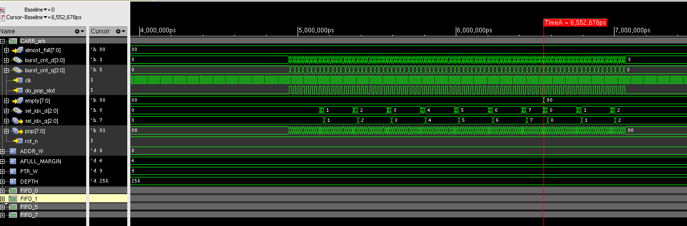


A second test case:

```text
============== Phase 2: Force FIFO5 almost-full, expect pre-emption =================

We push FIFO5 to almost full, and then see if our scheduler would prioritise the pop for FIFO5.

This phase will pop FIFOs for 20 times
```

Closely connected is the third test case:

```text
============== Phase 3: Burst limit switching =================

This test case start by pop 50 times of the FIFOs.

Then add in FIFO 1 and FIFO 2 with 60 words each.

Then it will pop 120 times to see if max read has been met.
```

The waveform showed FIFO 5 has been prioritised during test case 2 and keep on pooping for another 50 times

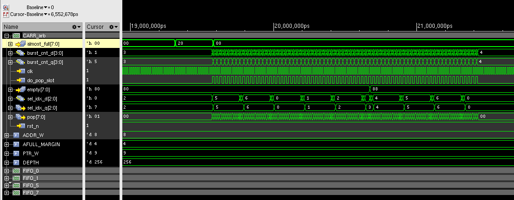

And the second half of the popping for all the FIFOs that keep switching and also pop for 8 or less if fifo is empty

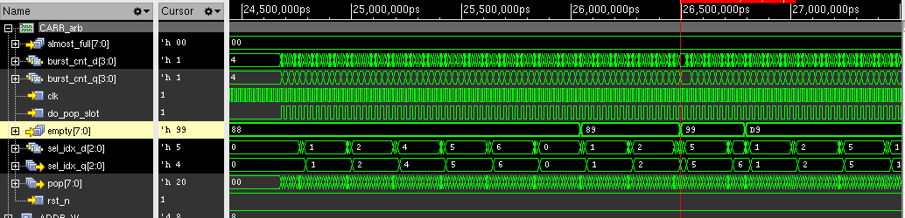


## 12 Feb 2026

The design for the arbiter that we have implemented, which is shown in the figure below, has the core selection implemented in synthesisable function block, we can update our selection of FIFO to pop every time a pop command is given.


Based on the empty, almost full flags, burst count of current selection and current FIFO ID, the functional block will export the next FIFO ID.

If this differs from current ID registered, it shall reset the burst count to 1 when the next pop slot command is issued.

Otherwise, it shall do simple increment of burst count.

With the blocks functional in this, we can probably envision the whole data line strucutre would look like below:


The whole dataline shall include a flow controller where it issues pop command by sending pulse for do_pop_slot, when the new data comes through, it will be muxed to data unpacker and saved in 8-bit FIFO. This will later be assembled by the controller into new frames.

The controller shall also logs down the number of words from each FIFO that has been poped to build up the frame.


## 16 Feb 2026

Since introducing word length would be difficult, it may seems easier to simply just pack our data without the word length bytes.

And it shall look like below:

```text
#### Start of the frame ####

[0xFA][0xCE] ==> "FACE"

#### Header ####

[0xXX] ==> type of the packet, key information or anything useful (number of channel sub-packets in this frame)

#### Sub packet start + Channel ID  ####

[0x5C] Reserved keywords for start of the channel content

[0xXX] Channel ID

#### Pay load ####

[0xXX] [0xXX] .......

#### End of the frame ####

[0xDE] [0xAD] ==> "DEAD"

#### IDLE word ####

[0xBC]

#### Training words ####

Alternating [0xBC] [0x4D]
```
But we would introduce byte stuffing while payload is transmitted to avoid ambiguity

```
###### Reserved keywords ######

SOF:

[0xFA] [0xCE]

EOF:

[0xDE] [0xAD]

IDLE/SYNC:

[0xBC] [0x4D]

CHS:

[0x5C]

ESC:

[0x7D]


###### Byte stuffing ######

When keywrods appear in payload, send [ESC] and then the (byte XOR 0x20)

e.g. if [0xBC] appears in payload, it will be converted into [0x5C] [0xAC] 

```

This new way of framing will likely be easier to be designed in hardware actually.


## 17 Feb 2026

After the meeting today talking about the reserved words that are 6 bytes out of 256, Piotr pointed out that maybe we do not need to escape all the keywords.

We should probably only escape the words that could confuse receiver during the control flow of payload, which should be **CHS**, **EOF** and **ESC**.

And to be safe, we should keep everything 16-bit based.

And in the payload, we should check them by word, not by byte. 

e.g. if 0xDE 0xED appeared in the payload, we do not escape it, because it does not match entirely **EOF** and would not cause confusion to receiver.

To make everything 16-bit wise, I propose the following updated word-stuffing method:

```algo
#### Start of the frame ####

[0xFA][0xCE] ==> "FACE"

#### Header ####

[0xXXXX] ==> type of the packet, key information or anything useful (number of channel sub-packets in this frame)

#### Sub packet start + Channel ID  ####

[0xC0DE] Reserved keywords for start of the channel content

[0xXXXX] Channel ID

#### Pay load ####

[0xXX] [0xXX] .......

#### End of the frame ####

[0xDE] [0xAD] ==> "DEAD"

#### IDLE word ####

[0xBCBC]

#### Training words ####

Alternating [0xBC] [0x4D]
```

Word stuffing as follow:

```algo
########### Reserved keywords ############

EOF:

[0xDEAD]

CHS:

[0xC0DE]

ESC:

[0xBEEF]

########### Word stuffing ############

When in payload, those 3 keywords appear:

1. Send *ESC* first [0xBEEF]
2. Send the (word XOR 0xFFFF)

So basically, only 3 cases:

+ EOF in payload: [0xBEEF] [0x2152]
+ CHS in payload: [0xBEEF] [0x3F21]
+ ESC in payload: [0xBEEF] [0x4110]
```

In this way, this would be the odd of 3 in $2^{16}$, basically $0.004577636%$ 

This word stuffing can be done by the unpacker, which can delay the pop process when needed.


## 18 Feb 2026

First, I tried to add some additional features to make dataline write down the output data from FIFOs:

And it will be organised in the following format:

```
Time Step, Channel ID, Popped Word(Hex), Popped Word(Dec)
0, 0, 0x7fff, 32767
1, 1, 0x7ffd, 32765
2, 1, 0x7ffe, 32766
```

Another class will be built to read the output text file and pack it into packets.

And by the end of it, we shall see the efficiency of different codings.

So with the original fixed word word length encoding and variable length encoding drafted, we tested both packetisations.

For the same test file, we have the following results:

```text
============ CARR PACKER FIXED LENGTH PACKET RATIO ============

Encoded packet size (in words):  18472
Original FIFO output size (in words):  12682
Packet ratio: 1.4565525942280397

============ CARR PACKER VARIABLE LENGTH PACKET RATIO ============

Encoded packet size (in words):  21166
Original FIFO output size (in words):  12682
Packet ratio: 1.6689796562056458
```

it shows that framing with byte stuffing will bring slightly higher overhead, but not by much.

And there has not been any word stuffing in this test.


## 20 Feb 2026

I am now trying to build up the hardware model with both compression and FIFOs. 

Given that we do not have the IP from UMC for DPRAM, I will have to write up the DPRAM myself and pack up my own behavioural FIFO model.

This will take a day or two.

## 23 Feb 2026

I am now actively developing the new async fifo based on a simple dual-port synchronous ram.

The structure has been set up, but we still do not know the exact behaviour of the DRAM yet.

I can only construct a DPSRAM based on my understanding for the behaviour simulaiton.

I hooked up the **POP** signal to the chip enable port of the DPSRAM, this has caused the delay of the data export.

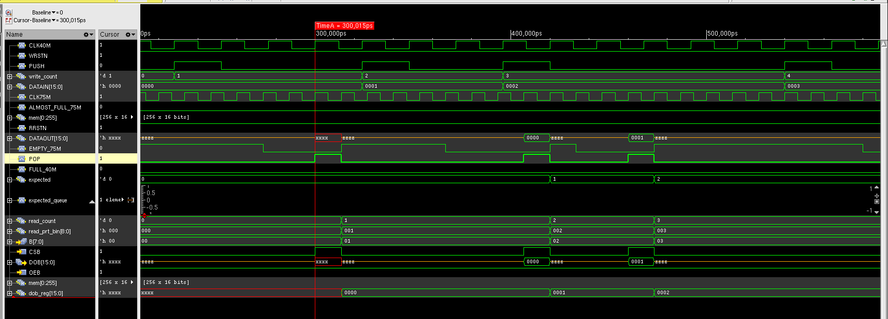

This is because our pop signal only enables the pop side, which would update the pop data one clock cycle later.

Such behvaiour has made the FIFO spit out the first data, but because the internal register is not updated yet, which made the value output at the first pop **XXX** instead of the real value.


## 24 Feb 2026

I have been **promised** the delivery of the DPSRAM today, which has not happend yet.

I will adjust the async FIFO accordingly when this has been delivered.

I have also designed a second variation with "fetch-forward" feature.

In this case, the async FIFO will basically take "POP" command as: POP will consume current output value, and next value will be updated in the next clock cycle.

This would mean that the time it takes from the pulse of "POP" to data being actually availble is basically a tri-state buffer away.

So on the read side, we do not have to wait for another cycle before data is given.

And now, we shall hook up our Encoder_5P with 4 FIFOs and arbiter to see if this works.


and also we need a system level "state machine" or controller to give control signals to our submodules.


## 25 Feb 2026

Starting to build some pipeline with the modules I have now.

Now I have connected the arbiter and fifo and compression module, I can probably do a quick simulation on the exsiting designs.

But I will need to generate the testbench pattern from the arrays I have.

Will have to do this with python.

Now I have the data ready and simulation should be easy.

Carrying out simulation now, I will start by pushing data for 100 cycles, and this has proven to be successful.


#### TEST case 1, continuous pushing of 55 rows of data

The pixel value pushed into the compression module is **60'hFFFFFFFF_FF....F** to begin with, and then changed to **60'hFFFFFFFF_FFFC7FFF** at count of 53 and return back to all FFFF right after.

This means only the second group of pixels has changed their value, from **7FFF** to **7FF8**.

So after this, because we have not popped any data yet, we should have data in all 4 FIFOs, with FIFO-0, FIFO-2, FIFO-3 and FIFO-4 storing data of 7FFF.

And FIFO-1 should have 3 words in it with:

```verilog
7FFF  // original value
8035  // time stamp of 0035
7FF8  // new pixel value
7FFF  // the value flicked back to 7FFF
```

From the simulation, it can be seen that the FIFO-1 carries the right data.

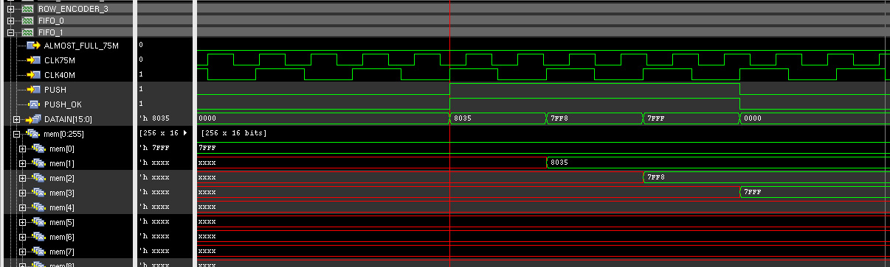

Will do more stressful test case tomorrow.


## 26 Feb 2026

I have been working on the licensing for MeMaker, which is not very successful.

And after some simple debugging, it shows that lmutil provided from the downloaded package cannot find hostid of modern Linux.

This is some horse shit I will have to put up with.


## 27 Feb 2026

I shall carry out more stressful test on the module today with some pop commands.

Okay, it seems that our great IT system has successfully blocked the requested RAM block.

I have raised an IT ticket to request the blocked attachment.

Now I will do more simulation.

So far it seems I should probably register the FIFO data output from the grouped FIFOs.

And if the do_pop_slot pulses are sent at 37.5MHz, our design should be able to handle it and our registered FIFO_DATA_OUT will be correct.

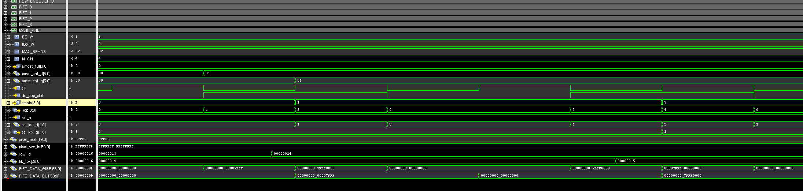

It is worth noting that the direct wire connection to FIFO data output is combinational, which will change due to the change of **POP** from the arbiter.

The reason why **POP** is changing is because the status of **empty** has changed after the posedge of clock.

And our FIFO output is basically:

```verilog
assign DATAOUT = POP? DOB: 16'd0;
```

Which means when pop changes from 1 -> 2 on the positive edge, different FIFOs were selected.

```text

        _____
       |
_______|

FIFO 0   FIFO 1
```

But because this **POP** change only happens after the clock edge, so even if FIFO 1 was selected, its read pointer will not be updated, therefore the data was not "consumed".

To eliminate frequent switching of FIFO_DATA_WIRE (the direct wire bus connection from FIFO groups), I would suggest register the output of the FIFO to FIFO_DATA_OUT, so we will not be impacted by the "temporary glitchy" output.

Therefore, we shall have sel_id_q synced with this registered FIFO data output, the flag to assert this validity can come from a registered "do_pop_slot".


### **Key cases to consider**

But there is the case I should consider before designing an external controller.

The controller should decide if do_pop_slot is reasonable.

For example, if all FIFOs are empty, we should not issue any do_pop_slot pulse.

Maybe another case would be if we are inserting reserved keywords to data unpacker, we should not issue any "do_pop_slot"


## 03 Mar 2026

Finally I have managed to generate my own memory block for generic II process with 2 variations:

Option 1 with column mux of 4; Option 2 with column mux of 8.

I will now verify the behaviour of this dual port SRAM by replacing the async fifo design's dual port SRAM with the real deal.

It appears that the provided DPRAM verilog module expects the real timing to satisfy the setup and hold check.

This has resulted in hold violation in the simulation purely because the write pointer updates at the rising edge of the clock with 0 delay.

Therefore, it won't pass the timing check and consequently lead to faulty behaviour.

But when I added a little delay at the write pointer register update, it passed the check successfully.

I shall move to the synthesis stage next.

The generated RAM of 256X16 for this process has the dimension of **294.9 um X 315.04 um** 


I just found that Faraday actually has an IP called 2-port register file that supports independent clocks with 1 side read and 1 side write.

This is actually perfect for FIFO build and it is smaller.

This generated RAM of 256X16 has the dimension of **301.56 um X 254.72 um**

This kinda works... proven by the simulation.

I will now also import the register file RAM into my virtuoso library.


Synthesis and post-synthesis simulation is imminent 


## 04 Mar 2026

Okay, I have not synthesised the async fifo of 16-bit with 256 words.

Ahhhh shit, the simulation breaks soon after reset was de-asserted....

It made me think that the write reset shouldn't be lifted at the positive edge of the write clock.

Okay!!! It seems my guess is correct!

We will definitely need reset synchronisation in the final design!!!

The new simulation looks okay with read and pop going on alright.

Wait... why did the fifo stopped reading...

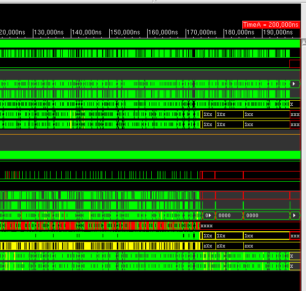

From the look of it...

It seems when write pointer increment from 279 to 280, the 40 MHz clock edge and 75 MHz clock edge were too close to each other.

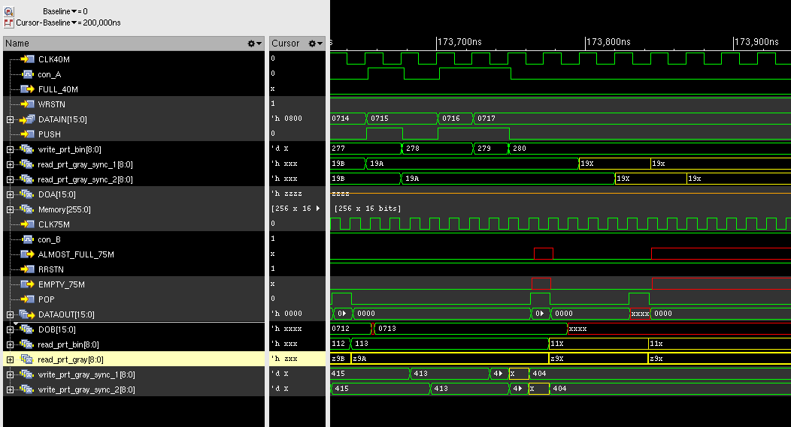

This has caused the write gray pointer synchroniser propagated X to the write clock domain.

This then caused Empty flag to fail... and coincidentally, a pop command was asserted in this cycle.

This has caused our read pointer logic to fail because it needs **(POP && ~Empty)**

This then led to the testbench fail to assert read command ever again.

From the sound of it, it is because the synchroniser was having a meta state in that situation...

But in the real case, this will **NOT** happen, because the synchroniser will definitely have a value instead of X, which then will not lead to read pointer increment fail.

I did a simple tweak on testbench to make it observe and drive pop at falling edge. So if unknown has been spotted for empty flag, it will not assert POP at the falling edge.

This has resolved the simulation issue.

The schematic after synthesis looks like this:

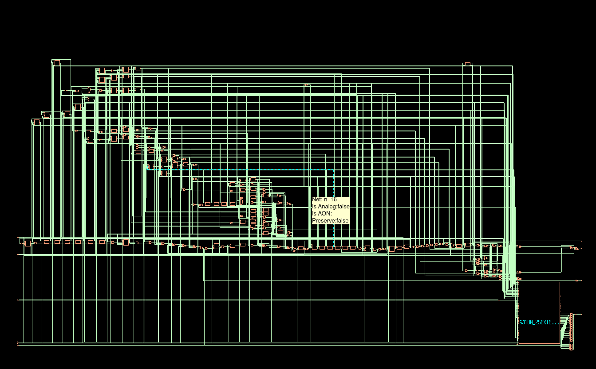


## 05 Mar 2026

Last night I also managed to make the synthesis work for 1W1R two port ram (Register file) SZ series.

And I have the gate level netlist for it.

Now I suppose I am not in a rush to proceed for layout place and route, I shall move on to the next module for synthesis.

Our arbiter will be next.

While I was doing simulations for the synthesised gate level of the arbiter, I found a hidden "bug".

Technically it is not a bug.

In a specific situation when there is only one FIFO is not empty, it shall stick to reading from that FIFO even when the burst reading count has exceeded 32, the set max read. 

We do have the fairness logic to prevent it from reading only one FIFO, but it shall stick to it if there is no other options. That is why one may see burst count exceeds 32.

Once there is another candidate, it will prioritise other candidate to keep it fair.

From the gate level simulation, it seems our arbiter is behaving ok.

Will do the synthesis for compression module next.

And then I will do gate level simulation with **compression module + Async FIFO + Arbiter**


## 06 Mar 2026

I will do the synthesis for the compression algorithm today.

The synthesis for the module has now completed, we will put the module up for gate level simulation.

It looks that our synthesised module has passed the simulation, and it works pretty well.

Maybe now, we can hook up the gate level module into the pipeline and do a big simulation.

But how do we pass multiple compiled SDF files into a top module with different gate level sub modules?

After checking with the xcelium support, I found the following example:

The following SDF command file contains separate sections that annotate distinct portions of a design hierarchy.

```bash
// File sdf.cmd
COMPILED_SDF_FILE = "cpu.sdf.X",
SCOPE = :m1,
LOG_FILE = "cpu_sdf.log";

COMPILED_SDF_FILE = "fpu.sdf.X",
SCOPE = :m2,
LOG_FILE = "fpu_sdf.log";

COMPILED_SDF_FILE = "dma.sdf.X",
SCOPE = :m3,
LOG_FILE = "dma_sdf.log";
```

And also because our Async fifo and row encoder was generated in a for loop, I have named our generate block, so that we could apply the sdf back annotation for each generated module.

And this has brought our SDF command file to this style:

```bash
// Async FIFO

COMPILED_SDF_FILE = "/export/home/j05003sx/Chip4_DUNE/Async_FIFO_256X16/sim/Async_FIFO_256X16_delay.sdf.X",
SCOPE = tb_Encoder_FIFO_ARB.i_Encoder_FIFO_ARB.Encoder_FIFO_GEN[0].Async_FIFO_256X16_inst,
LOG_FILE = "Async0_sdf.log",
MTM_CONTROL = "MAXIMUM";


COMPILED_SDF_FILE = "/export/home/j05003sx/Chip4_DUNE/Async_FIFO_256X16/sim/Async_FIFO_256X16_delay.sdf.X",
SCOPE = tb_Encoder_FIFO_ARB.i_Encoder_FIFO_ARB.Encoder_FIFO_GEN[1].Async_FIFO_256X16_inst,
LOG_FILE = "Async1_sdf.log",
MTM_CONTROL = "MAXIMUM";

// Encoder

COMPILED_SDF_FILE = "/export/home/j05003sx/Chip4_DUNE/Row_encoder_5P+/sim/Row_encoder_5P+_delay.sdf.X",
SCOPE = tb_Encoder_FIFO_ARB.i_Encoder_FIFO_ARB.Encoder_FIFO_GEN[0].Row_encoder_5P_plus_inst,
LOG_FILE = "Encoder0_sdf.log",
MTM_CONTROL = "MAXIMUM";

COMPILED_SDF_FILE = "/export/home/j05003sx/Chip4_DUNE/Row_encoder_5P+/sim/Row_encoder_5P+_delay.sdf.X",
SCOPE = tb_Encoder_FIFO_ARB.i_Encoder_FIFO_ARB.Encoder_FIFO_GEN[1].Row_encoder_5P_plus_inst,
LOG_FILE = "Encoder1_sdf.log",
MTM_CONTROL = "MAXIMUM";


// Arbiter

COMPILED_SDF_FILE = "/export/home/j05003sx/Chip4_DUNE/CARR_arb/sim/CARR_arb_delay.sdf.X",
SCOPE = tb_Encoder_FIFO_ARB.i_Encoder_FIFO_ARB.i_CARR_arb,
LOG_FILE = "ARB_sdf.log",
MTM_CONTROL = "MAXIMUM";
```

And under this scheme with gate level simulation, it appears that our design is working perfectly.


## 09 Mar 2026

I am now thinking about this controller design. Will have to first define the behaviour I want and ports I need for this.

This whole logic shall be reviewed and modelled as below:

```text
Encoder_FIFO_arb
        │
        ▼
Packet Builder
   ├ frame FSM
   ├ channel header insertion
   └ payload escape
        │
        ▼
Frame FIFO
        │
        ▼
Link Layer
        │
        ▼
16→8 unpacker
        │
        ▼
PHY

```


## 10 Mar 2026

Just realised I almost forgot clock forwarding...

I still need to think of the clock forwarding logic. 

Maybe it will be a separate logic that is shared by 4-5 groups of LVDS transmitter (100 pixels)

Just realised my async fifo does not support burst read.

This is because the output of the Async fifo **DATAOUT** is a combinational signal.

which has the following expression:

```verilog 
assign DATAOUT = POP ? DOB: 16'd0;
```

But the data from the fifo has 1 clock cycle delay, and I am doing fetch forward FIFO design.

Say I am raising a 5-cycle do pop slot non-stop

At the 1st cycle I will consume the correct data, but at the 2nd cycle, the read pointer has just updated, which means the data from FIFO stays unchanged.

On the 3rd cycle I am consuming the 2nd data and it goes on.

```text

cycle       do_pop_slot      read_ptr       DOB           dataout
  0             0               1           mem[1]           0
  1             1               1           mem[1]          mem[1]
  2             1               2  ___      mem[1]          mem[1]
  3             1               3     |===> mem[2]          mem[2]
  4             1               4           mem[3]          mem[3]
  5             1               5           mem[4]          mem[4]
  6             0               6           mem[5]            0
```

Therefore, the pulse to do pop slot can only be asserted at a flickering style maxed out at 37.5MHz. like this: "10101010101"

I should probably fix this at my next iteration of design.


## 11 Mar 2026

I currently plan to have the following behaviour for the state machine:

```text
do_pop_slot         dat_valid         DATA        SEL_ID        DATA_OUT        FRAME_FIFO_PUSH
    0                   0               X           X             FACE                  1
    0                   0               X           X             META                  1
    1                   0               X           X             C0DE                  1 // prefetch data to get cid to begin with 
    0                   1               A          CID1           CID1                  1
    1                   0               A          CID1            A                    1
    0                   1               B          CID1            x                    0
    1                   0               B          CID1            B                    1
    0                   1               C          CID2           C0DE                  1 // saved cid differs from the new cid
    0                   0               C          CID2           CID2                  1
    1                   0               C          CID2            C                    1
    0                   1               D          CID3           C0DE                  1 // saved cid differs from the new cid
    0                   0               D          CID3           CID3                  1 
    1                   0               D          CID3            D                    1 
    0                   1               E          CID3            X                    0 // data from the same cid.
    1                   0               E          CID3            E                    1 // normal push
    0                   1               F          CID3            X                    0
    1                   0               F          CID3            F                    1
    0                   1               G          CID1           DEAD                  1 // cid wraps around/drops, finish current frame
    0                   0               G          CID1           FACE                  1 // new frame starts
    0                   0               G          CID1           META                  1 // new meta data
    0                   0               G          CID1           C0DE                  1 // because last frame finished due to cid wrap, no prefetch
    0                   0               G          CID1           CID1                  1 // continue from last cid
    1                   0               G          CID1            G                    1
    0                   1               H          CID1            X                    0
    1                   0               H          CID1            H                    1
    0                   1               I          CID2           C0DE                  1
    0                   0               I          CID2           CID2                  1
    1                   0               I          CID2            I                    1
    0                   1               J          CID3           C0DE                  1
    0                   0               J          CID3           CID3                  1
    1                   0               J          CID3            J                    1
    0                   1               K          CID4           C0DE                  1
    0                   0               K          CID4           CID4                  1
    1                   0               K          CID4            K                    1
    0                   1               L          CID4            X                    0
    1                   0               L          CID4            L                    1
    0                   1               M          CID4            X                    0 // FIFO empty, stop issuing pop command
    0                   0               M          CID4            M                    1
    0                   0               M          CID4           DEAD                  1 // Naturally finish this frame, go back to IDLE until fifo is filled again
    0                   0               M          CID4            X                    0 
    0                   0               M          CID4            X                    0 
    0                   0               M          CID4            X                    0 // FIFO got new data
    0                   0               M          CID4           FACE                  1
    0                   0               M          CID4           META                  1
    1                   0               M          CID4           C0DE                  1 // New frame begins...
  ...
```                                                                               


## 12 Mar 2026

After carefully reviewing the table and running the state mapping, I have now successfully drafted a preliminary version of the state machine we need.

It seems that it is doing just fine for now.

But,  a big **BUT**. The following cases have not yet been included:

+ Escape mechanism (maybe an extra state? or squeeze it in somewhere...)
+ When FRAME fifo is full. (currently we still pushes data into it)
+ Overflow contingency for pixel FIFO has not been dealt with

My priority is escape mechanism and the second one when FRAME FIFO is full.

These 2 should be easy to add.

But I could do a quick simulation now by our packet builder and the module before it.

Just did a quick behaviour level simulation with **CARR arbiter**, **Async fifo**, **Row encoder** and **Packet builder FSM**. it shows that our design can quickly deplete the pixel FIFOs.

From the waveform, it shows that the data FIFO can be empty half of the time under this "real image"

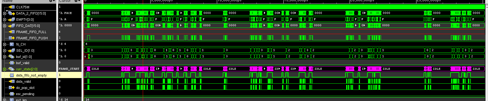

But this is probably not the most efficient way of doing it because if it is not filled by a lot, the arbiter may need to frequently change the FIFOs to read. And this is not the best practice for our encoding because we need to insert extra key words.


## 13 Mar 2026

I reviewed again about the 8:1 serialiser design that I previously looked at.

The reported paper simply used double edge triggered flip-flops and 3 different clocks at different rates to do the 8 to 1 serialisation.

The structure will look like this:

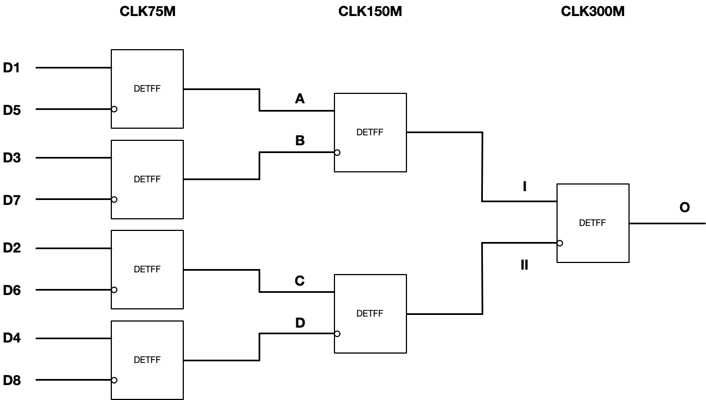

And correspondingly, the waveform might look like this:

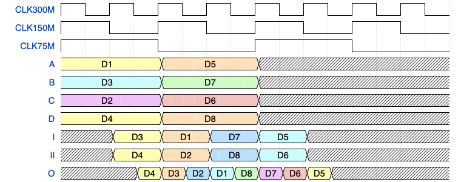


## 16 Mar 2026

I have now included 2 extra states into my state machine.

**ESC_DATA** and **COOLDOWN**.

### **Data escaping mechanism**

In the state of data consumption **PAYLOAD** and the payload is in the reserved words, it will simply output **BEEF** at this state and jump into **ESC_DATA** to output **PAYLOAD ^ FFFF**

In the state **ESC_DATA**, it will act similarly as state **PAYLOAD**, it requests new data if the pixel data fifo is not empty.


### **FRAME FIFO ALMOST FULL**

We will only check if frame fifo is almost full at the state of payload_X, because data will be pushed into FIFO and a new data will be requested in state of **PAYLOAD**, we shall check first if the frame fifo is almost full at this state, if it is almost full, we will output nothing and jump to **COOLDOWN**, and wait until it is no longer almost full.

We will only start evaluating the next step When we jump back to **PAYLOAD_X**.

```text
---- Same channel stream ---- ## same channel data from 0 -> 1111
153000 OUTPUT: face
167000 OUTPUT: 0000  --> Frame count: 0000
180000 OUTPUT: c0de
193000 OUTPUT: 0000  
207000 OUTPUT: 0000  --> DATA: 0000, CID: 000
233000 OUTPUT: 0001  --> DATA: 0001, CID: 000
260000 OUTPUT: 0002           .
287000 OUTPUT: 0003           .
313000 OUTPUT: 0004           .
340000 OUTPUT: 0005  --> DATA: 0005, CID: 000
367000 OUTPUT: 0006  --> DATA: 0006, CID: 000

---- Channel switch test ---- ## channel switch from 0 -> 1
393000 OUTPUT: 0007
420000 OUTPUT: 1111  --> DATA: 1111, CID: 000
433000 OUTPUT: c0de                        |
447000 OUTPUT: 0001                        V
460000 OUTPUT: 2222  --> DATA: 2222, CID: 001

---- Reserved payload test ---- ## channel 2 -> 1 frame wrap  &&&& reserved word C0DE and then BEEF and DEAD 
473000 OUTPUT: c0de
487000 OUTPUT: 0002  --> DATA: 3333, CID: 002
500000 OUTPUT: 3333
513000 OUTPUT: dead  
527000 OUTPUT: face 
540000 OUTPUT: 0001  --> Frame count: 0001
553000 OUTPUT: c0de
567000 OUTPUT: 0001
580000 OUTPUT: beef  --> DATA: C0DE, CID: 001
593000 OUTPUT: 3f21  
620000 OUTPUT: beef  --> DATA: BEEF, CID: 001
633000 OUTPUT: 4110

---- Channel wrap test ----
660000 OUTPUT: beef  --> DATA: DEAD, CID: 001
673000 OUTPUT: 2152
687000 OUTPUT: c0de
700000 OUTPUT: 0003  --> DATA: AAAA, CID: 003
713000 OUTPUT: aaaa

---- Backpressure test ----
727000 OUTPUT: dead
740000 OUTPUT: face
753000 OUTPUT: 0002  --> Frame count: 0002
767000 OUTPUT: c0de
780000 OUTPUT: 0000
793000 OUTPUT: bbbb  --> DATA: BBBB, CID: 000
833000 OUTPUT: c0de
847000 OUTPUT: 0002
860000 OUTPUT: 0008  --> DATA: 0008, CID: 002
887000 OUTPUT: 0009
913000 OUTPUT: 000a
940000 OUTPUT: 000b
967000 OUTPUT: 000c
993000 OUTPUT: 000d
1020000 OUTPUT: 000e
1047000 OUTPUT: 000f
1073000 OUTPUT: 0010

---- FIFO empty termination ----
1100000 OUTPUT: 0011
1113000 OUTPUT: dead  --> PIXEL FIFOs are empty
1127000 OUTPUT: face
1140000 OUTPUT: 0003
1153000 OUTPUT: c0de
1167000 OUTPUT: 0001
1180000 OUTPUT: 0012
1207000 OUTPUT: 0013
1233000 OUTPUT: 0014
1247000 OUTPUT: dead
```

The packet builder is now basically built, except the overflow contingency.


Maybe I will leave that to next iteration.


## 17 Mar 2026


I should now start the RTL design for the rest of the module.

what I have left is basically a scheduler and packet_builder_FIFO (synchronous) and data unpacker.

### **pkt_builder_fifo**

I have now finished the implementation of the sync fifo, it is fairly easy with the ideal behaviour of the dual-port ram.

I will now try to generate a 512 by 16 dual port ram (2W2R) and a 512 by 16 register file (1W1R) IP to integrate them into the sync fifo.

Was having problem opening up Memaker again...

This time it hangs at the start up.

After some checking, I realised I have been using Ubuntu Wayland instead of X11.

After switching back to XORG, it worked.

Now I have also generated dual-port ram with 512 by 16 and register file with 512 by 16.

With the REG_FILE IP integrated, it has also been verified that the behaviour is correct.


## 18 Mar 2026

I will now try the other IP, dual-port ram.

My PC just crashed at ubuntu xorg, now I am switching back to wayland. cus it seems other gui does not work either.

The module has also been verified with no problem.

I will now proceed with module tx_link_controller.

Which will basically do the flow control to insert IDLE words when needed, and do training at the beginning.

I have now verified the behaviour level of the link layer control.

And it seems the testbench can reconstruct the frame after it was transmitted.

This can signifies the RTL freeze for now.


## 19 Mar 2026

Maybe it is time for a system level simulation or test.

I am considering Cocotb for this task.

The whole digital module will be split into 3 parts:

+ Encoder_FIFO_Arbiter
+ Packet_builder
+ PKT_FIFO_LINK


The First module will have 4 Row_based_encoder_5P+, 4 Async pixel FIFO and 1 of our CARR arbiter.

The Second module will only have itself for the packet builder FSM

The Third module will have a link controller and Sync FIFO for frame and a gearbox for 16 to 8.


There are some tiny details I should consider for future tapeout or at least fix them this time.

+ Reset synchronisation (The async fifo has 2 resets, they should be hooked to different reset synchronisers)
+ Global counter tiktok
+ Extra register of the data coming out of the Async FIFO

Good news, it looks that our system works pretty well.

The whole data chain can correctly pick up the right fifo and pick up the right data and produce the correct data stream.

I shall now move on to system-level verification, this time it shall be verified by Cocotb given that the behavioural level simulation looks correct.

I am very satisfied with the RTL design at the moment.

